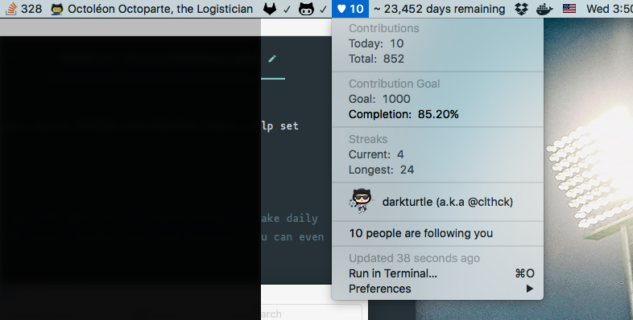

# GitBar

:octocat: A plugin for [BitBar](https://github.com/matryer/bitbar) to quickly show your open source GitHub contribution stats, help set contribution goals, all on your _**macOS**(formerly OS X) menu bar_. :octocat:  

(Inspired by [Dan Cadden](https://github.com/Shikkic/gitbar)'s plugin)

>Almost all of us have private repos we tend to work on, and it's really easy to neglect your OSS work. So, I created Gitbar to make daily public contributions a habit. Gitbar is a OSX Menu Bar utility that shows your daily GitHub stats, streaks, and contributions. You can even set contribution goals in the application. - _Dan Cadden_



### Prerequisites
- macOS (Snow Leopard or newer (>= 10.6))
- [Node.js](https://nodejs.org/en/) and [npm](http://blog.npmjs.org/post/85484771375/how-to-install-npm) ([nvm](https://github.com/creationix/nvm) is recommended)

### Installation
First, download and install [BitBar](https://github.com/matryer/bitbar).

Clone the plugin repo:
```sh
git clone https://github.com/clthck/gitbar
```

Inside the repo folder, install the dependencies:
```sh
npm i
```

### Configuration

In the root folder you'll need to make `.env` file with **your** GitHub username (copy `sample.env` and rename it). Here you'll also be able to customize contribution goal tracking as well. Simply give the tracking value `TRUE` or `FALSE` to turn it on or off, respectively, and provide your ideal goal number to give yourself a completion percentage.

```bash
GITHUB_USERNAME="<YOUR_GITHUB_NAME_HERE>"
CONTRIBUTION_GOAL_TRACKING=true
CONTRIBUTION_GOAL="1000"
COMPACT_UI=true
```

Now, launch BitBar and select the `gitbar_plugin` folder as your Plugin Folder.

### Gotchas

If you have an error resulting from your path to Node, edit the shebang at the top of `gh.5m.js` to include the correct path.

To find the correct path simply run:
```sh
which node
```
Or if you don't want to edit `gh.5m.js` file, hit the following:
```sh
ln -s $(which node) /usr/local/bin/node
```

### Dependencies

Obviously [BitBar](https://github.com/matryer/bitbar).

I also use the [github-contrib-stats](https://github.com/clthck/github-contrib-stats) to crawl GitHub and parse selected values from public GitHub profiles. Feel free to contribute if you'd like!

I use this module as GitHub API doesn't provide necessary data yet.

#### Suggestions, comments?

Feel free to create an issue or reach out on the :speech_balloon: [BitBar Slack](https://getbitbar.herokuapp.com/) or Twitter [@clthck](http://twitter.com/clthck)!
